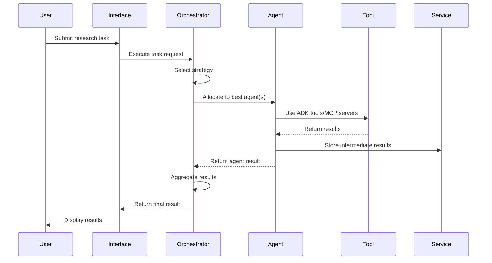
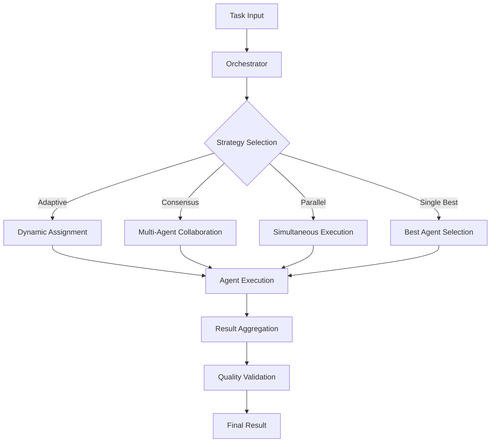
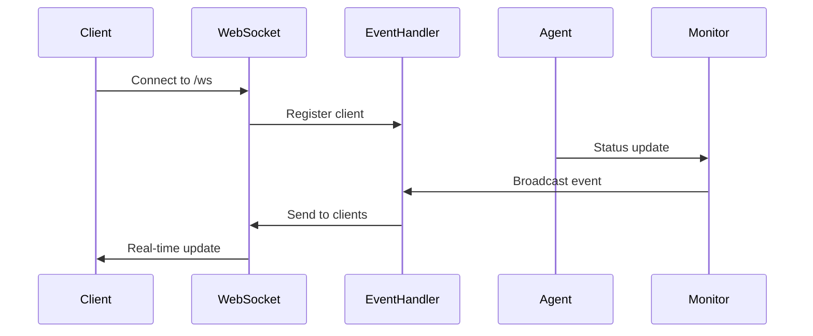

# Architecture Overview

This document provides a comprehensive overview of the Multi-Agent Research Platform architecture, including system design, component interactions, data flows, and integration patterns.

## 🏗️ System Architecture

### High-Level Architecture

```
┌─────────────────────────────────────────────────────────────────────────────┐
│                              User Layer                                     │
├──────────────────────────┬─────────────────────┬──────────────────────────────┤
│     End Users            │    Developers       │    System Administrators    │
│  (Researchers, Analysts) │   (API Consumers)   │      (Operations)            │
└──────────────────────────┴─────────────────────┴──────────────────────────────┘
                                      │
┌─────────────────────────────────────────────────────────────────────────────┐
│                           Interface Layer                                   │
├──────────────────────────┬─────────────────────┬──────────────────────────────┤
│   Streamlit Interface    │    Web Interface    │      REST APIs              │
│   (Production UX)        │   (Debug/Monitor)   │   (Programmatic Access)     │
│   Port: 8501             │   Port: 8081        │   /api/v1/*                  │
└──────────────────────────┴─────────────────────┴──────────────────────────────┘
                                      │
┌─────────────────────────────────────────────────────────────────────────────┐
│                         Communication Layer                                 │
├──────────────────────────┬─────────────────────┬──────────────────────────────┤
│      HTTP/REST           │     WebSockets      │        Events               │
│   (Synchronous APIs)     │   (Real-time comm)  │   (Async notifications)     │
└──────────────────────────┴─────────────────────┴──────────────────────────────┘
                                      │
┌─────────────────────────────────────────────────────────────────────────────┐
│                        Orchestration Layer                                  │
├──────────────────────────┬─────────────────────┬──────────────────────────────┤
│   Agent Orchestrator     │   Task Manager      │    Strategy Engine          │
│   (Coordination)         │   (Lifecycle)       │   (Decision Making)         │
└──────────────────────────┴─────────────────────┴──────────────────────────────┘
                                      │
┌─────────────────────────────────────────────────────────────────────────────┐
│                           Agent Layer                                       │
├────────────────┬─────────────────┬─────────────────┬─────────────────────────┤
│   LLM Agents   │ Workflow Agents │ Custom Agents   │    Agent Registry       │
│   (9 roles)    │ (Processes)     │ (12 types)      │   (Management)          │
└────────────────┴─────────────────┴─────────────────┴─────────────────────────┘
                                      │
┌─────────────────────────────────────────────────────────────────────────────┐
│                           Service Layer                                     │
├────────────────┬─────────────────┬─────────────────┬─────────────────────────┤
│ Session Service│ Memory Service  │ Artifact Service│   Logging Service       │
│ (State mgmt)   │ (Data storage)  │ (File handling) │   (Centralized logs)    │
└────────────────┴─────────────────┴─────────────────┴─────────────────────────┘
                                      │
┌─────────────────────────────────────────────────────────────────────────────┐
│                         Integration Layer                                   │
├────────────────┬─────────────────┬─────────────────┬─────────────────────────┤
│  Google ADK    │   Built-in      │  MCP Servers    │   External APIs         │
│  (Foundation)  │   Tools         │  (Extensions)   │   (Third-party)         │
└────────────────┴─────────────────┴─────────────────┴─────────────────────────┘
                                      │
┌─────────────────────────────────────────────────────────────────────────────┐
│                         Infrastructure Layer                                │
├────────────────┬─────────────────┬─────────────────┬─────────────────────────┤
│   Local Dev    │  Google Cloud   │    Docker       │      Databases          │
│   (FastAPI)    │    (Cloud Run)  │  (Containers)   │    (SQLite/Cloud)       │
└────────────────┴─────────────────┴─────────────────┴─────────────────────────┘
```

## 🧩 Core Components

### 1. Interface Layer

#### Streamlit Interface
- **Purpose**: Production user interface for end users
- **Technology**: Streamlit framework with custom components
- **Features**: Interactive dashboards, agent management, task execution
- **Target Users**: Researchers, analysts, business users

#### Web Debug Interface  
- **Purpose**: Development and monitoring interface
- **Technology**: FastAPI with HTML templates and WebSockets
- **Features**: Real-time monitoring, debugging tools, system health
- **Target Users**: Developers, system administrators

#### REST APIs
- **Purpose**: Programmatic access to platform capabilities
- **Technology**: FastAPI with automatic OpenAPI documentation
- **Features**: Agent management, task execution, monitoring
- **Target Users**: API consumers, integrations

### 2. Orchestration Layer

#### Agent Orchestrator
```python
class AgentOrchestrator:
    """
    Central coordinator for multi-agent tasks.
    
    Responsibilities:
    - Strategy selection and execution
    - Agent allocation and load balancing
    - Result aggregation and consensus building
    - Performance monitoring and optimization
    """
```

**Key Features:**
- **Dynamic Strategy Selection**: Chooses optimal collaboration approach
- **Load Balancing**: Distributes tasks across available agents
- **Consensus Building**: Aggregates results from multiple agents
- **Performance Tracking**: Monitors execution metrics and success rates

#### Task Manager
```python
class TaskManager:
    """
    Manages task lifecycle and execution.
    
    Responsibilities:
    - Task queuing and prioritization
    - Execution monitoring and timeout handling
    - Result collection and validation
    - Error handling and retry logic
    """
```

#### Strategy Engine
```python
class StrategyEngine:
    """
    Implements orchestration strategies.
    
    Available Strategies:
    - Adaptive: Dynamic strategy selection
    - Consensus: Multi-agent collaboration
    - Parallel: Simultaneous execution
    - Single Best: Optimal agent selection
    - Competitive: Agent competition
    """
```

### 3. Agent Layer

#### Agent Registry
```python
class AgentRegistry:
    """
    Central registry for agent management.
    
    Capabilities:
    - Agent registration and discovery
    - Capability mapping and matching
    - Performance tracking and metrics
    - Health monitoring and status
    """
```

#### Agent Types

**LLM Agents (9 Specialized Roles):**
```python
class LLMAgent(Agent):
    """Base class for LLM-powered agents with specialized roles."""
    
    roles = [
        "researcher",      # Research and data gathering
        "analyst",         # Data analysis and interpretation  
        "writer",          # Content creation and documentation
        "critic",          # Review and quality assurance
        "synthesizer",     # Information synthesis
        "domain_expert",   # Specialized domain knowledge
        "translator",      # Language translation
        "summarizer",      # Content summarization
        "generalist"       # General-purpose assistance
    ]
```

**Workflow Agents:**
```python
class WorkflowAgent(Agent):
    """Agents for process orchestration and multi-step tasks."""
    
    workflow_types = [
        "sequential",      # Step-by-step execution
        "parallel",        # Concurrent processing
        "conditional",     # Decision-based flow
        "iterative",       # Repeated refinement
        "recursive"        # Self-calling processes
    ]
```

**Custom Agents (12 Specialized Types):**
```python
class CustomAgent(Agent):
    """Domain-specific agents for specialized tasks."""
    
    agent_types = [
        "domain_expert",   # Subject matter expertise
        "fact_checker",    # Verification and validation
        "data_analyst",    # Statistical analysis
        "code_reviewer",   # Technical code analysis
        "content_creator", # Creative content generation
        "translator",      # Multi-language support
        "summarizer",      # Content condensation
        "researcher",      # Comprehensive research
        "analyst",         # Deep analysis
        "writer",          # Professional writing
        "critic",          # Quality assessment
        "moderator"        # Discussion facilitation
    ]
```

### 4. Service Layer

#### Session Service
```python
class SessionService:
    """
    Manages user sessions and state.
    
    Features:
    - Session lifecycle management
    - State persistence and retrieval
    - User authentication and authorization
    - Session timeout and cleanup
    """
```

#### Memory Service
```python
class MemoryService:
    """
    Provides memory and caching capabilities.
    
    Features:
    - Short-term memory for conversations
    - Long-term storage for historical data
    - Caching for performance optimization
    - Memory cleanup and optimization
    """
```

#### Artifact Service
```python
class ArtifactService:
    """
    Handles file and artifact management.
    
    Features:
    - File upload and storage
    - Version control and history
    - Access control and permissions
    - Cleanup and retention policies
    """
```

### 5. Integration Layer

#### Google ADK Integration
```python
class ADKIntegration:
    """
    Integration with Google Agent Development Kit.
    
    Provides:
    - FastAPI app factory
    - Built-in tool access
    - Vertex AI integration
    - Authentication handling
    """
```

#### Built-in Tools
- **Google Search**: Web search capabilities
- **Code Execution**: Python code execution
- **Vertex AI Search**: Enterprise search
- **BigQuery**: Data analysis and querying

#### MCP (Model Context Protocol) Servers
- **Perplexity**: Advanced search and reasoning
- **Tavily**: Research and fact-checking
- **Brave Search**: Alternative search engine
- **Omnisearch**: Unified search interface

## 🔄 Data Flow

### Task Execution Flow



### Agent Communication Pattern



### Real-time Updates Flow



## 🎯 Design Patterns

### 1. Factory Pattern
```python
class AgentFactory:
    """Creates agents based on specifications."""
    
    def create_agent(self, agent_type: str, config: dict) -> Agent:
        if agent_type == "llm":
            return LLMAgent(config)
        elif agent_type == "workflow":
            return WorkflowAgent(config)
        elif agent_type == "custom":
            return CustomAgent(config)
```

### 2. Observer Pattern
```python
class EventHandler:
    """Notifies observers of system events."""
    
    def notify_observers(self, event: Event):
        for observer in self.observers:
            observer.update(event)
```

### 3. Strategy Pattern
```python
class OrchestrationStrategy:
    """Defines different collaboration strategies."""
    
    def execute(self, task: Task, agents: List[Agent]) -> Result:
        # Strategy-specific implementation
        pass
```

### 4. Registry Pattern
```python
class AgentRegistry:
    """Central registry for agent discovery and management."""
    
    _agents: Dict[str, Agent] = {}
    
    @classmethod
    def register(cls, agent: Agent):
        cls._agents[agent.agent_id] = agent
```

## 🔐 Security Architecture

### Authentication & Authorization

```python
class SecurityService:
    """Handles authentication and authorization."""
    
    def authenticate_user(self, credentials: dict) -> User:
        # Verify user credentials
        pass
    
    def authorize_action(self, user: User, action: str) -> bool:
        # Check user permissions
        pass
```

### API Security
- **Rate Limiting**: Prevents abuse and ensures fair usage
- **Input Validation**: Sanitizes and validates all inputs
- **CORS Configuration**: Controls cross-origin requests
- **API Key Management**: Secures external service access

### Data Protection
- **Environment Variable Isolation**: API keys stored securely
- **Session Encryption**: User sessions protected
- **Audit Logging**: All actions logged for security monitoring
- **Data Retention Policies**: Automatic cleanup of sensitive data

## 📊 Performance Architecture

### Caching Strategy

```python
class CacheService:
    """Implements multi-level caching for performance."""
    
    levels = [
        "memory",      # In-memory cache for hot data
        "redis",       # Distributed cache for shared data
        "database",    # Persistent cache for cold data
    ]
```

### Load Balancing

```python
class LoadBalancer:
    """Distributes load across available agents."""
    
    def select_agent(self, task: Task, agents: List[Agent]) -> Agent:
        # Consider agent load, performance, and capabilities
        pass
```

### Monitoring & Metrics

```python
class MetricsCollector:
    """Collects and aggregates system metrics."""
    
    metrics = [
        "response_time",     # Task execution time
        "success_rate",      # Task success percentage
        "agent_utilization", # Agent usage patterns
        "error_rate",        # System error frequency
    ]
```

## 🔧 Configuration Architecture

### Environment-based Configuration

```python
class ConfigManager:
    """Manages configuration across environments."""
    
    environments = {
        "development": DevelopmentConfig,
        "staging": StagingConfig,
        "production": ProductionConfig,
    }
```

### Feature Flags

```python
class FeatureFlags:
    """Controls feature availability."""
    
    flags = {
        "enable_real_time_updates": True,
        "enable_advanced_analytics": False,
        "enable_experimental_features": False,
    }
```

## 🚀 Deployment Architecture

### Local Development

```yaml
# docker-compose.yml for local development
version: '3.8'
services:
  app:
    build: .
    ports:
      - "8080:8080"
    environment:
      - ENVIRONMENT=development
      - GOOGLE_GENAI_USE_VERTEXAI=false
```

### Cloud Production

```yaml
# Google Cloud Run configuration
apiVersion: serving.knative.dev/v1
kind: Service
metadata:
  name: multi-agent-platform
spec:
  template:
    spec:
      containers:
      - image: gcr.io/PROJECT_ID/multi-agent-platform
        env:
        - name: GOOGLE_GENAI_USE_VERTEXAI
          value: "true"
```

## 📈 Scalability Considerations

### Horizontal Scaling
- **Stateless Design**: Services can be replicated
- **Load Distribution**: Tasks distributed across instances
- **Database Partitioning**: Data spread across multiple databases

### Vertical Scaling
- **Resource Optimization**: Efficient memory and CPU usage
- **Caching Strategies**: Reduce computational overhead
- **Performance Monitoring**: Identify bottlenecks

### Cloud-Native Features
- **Auto-scaling**: Automatic capacity adjustment
- **Health Checks**: Service health monitoring
- **Circuit Breakers**: Fault tolerance and recovery

## 🔍 Monitoring & Observability

### Logging Architecture

```python
class LoggingService:
    """Centralized logging with structured output."""
    
    def log(self, level: str, message: str, context: dict):
        structured_log = {
            "timestamp": datetime.utcnow(),
            "level": level,
            "message": message,
            "context": context,
            "service": self.service_name,
        }
        self.output(structured_log)
```

### Metrics Collection

```python
class MetricsService:
    """Collects and exports metrics for monitoring."""
    
    def record_metric(self, name: str, value: float, tags: dict):
        self.metrics_backend.record(name, value, tags)
```

### Health Checks

```python
class HealthCheckService:
    """Provides health status for system components."""
    
    def check_health(self) -> HealthStatus:
        return {
            "status": "healthy",
            "components": self.check_all_components(),
            "timestamp": datetime.utcnow(),
        }
```

## 🔮 Future Architecture Considerations

### Planned Enhancements
- **Microservices Architecture**: Split into independent services
- **Event-Driven Architecture**: Async event processing
- **GraphQL API**: More flexible API queries
- **Kubernetes Deployment**: Container orchestration

### Integration Roadmap
- **More MCP Servers**: Additional external service integrations
- **Custom Tool Development**: User-defined tool creation
- **Advanced Analytics**: Machine learning insights
- **Multi-tenant Support**: Isolated user environments

---

This architecture provides a solid foundation for the Multi-Agent Research Platform while maintaining flexibility for future enhancements and scalability requirements.