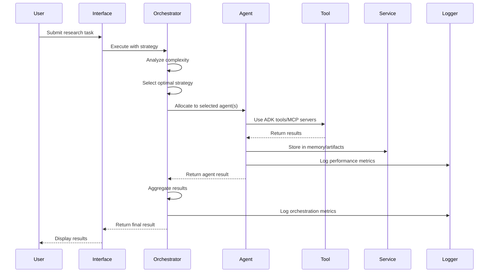
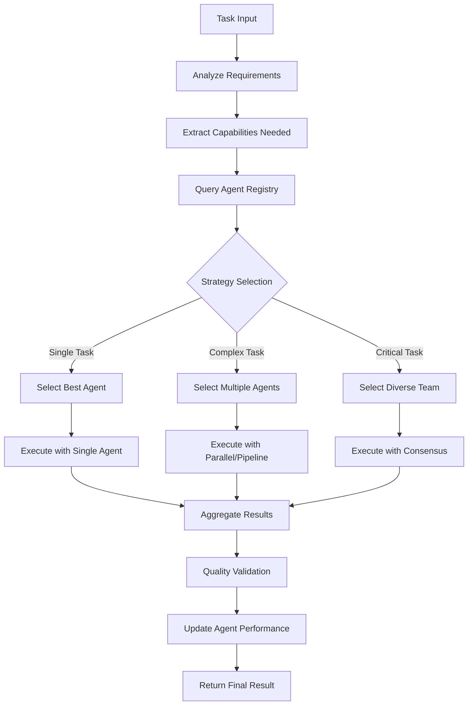

# Multi-Agent Research Platform - Architecture Documentation

This document provides a comprehensive overview of the Multi-Agent Research Platform architecture, documenting the **actual implementation** as it exists today rather than idealized designs.

## 🏗️ System Architecture Overview

The Multi-Agent Research Platform is a sophisticated, enterprise-grade system built on Google ADK v1.5.0 with advanced multi-agent orchestration, external service integration, and comprehensive monitoring capabilities.

### High-Level Architecture

```
┌─────────────────────────────────────────────────────────────────────────────┐
│                              User Layer                                     │
├──────────────────────────┬─────────────────────┬──────────────────────────────┤
│     End Users            │    Developers       │    System Administrators    │
│  (Researchers, Analysts) │   (API Consumers)   │      (Operations)            │
└──────────────────────────┴─────────────────────┴──────────────────────────────┘
                                      │
┌─────────────────────────────────────────────────────────────────────────────┐
│                           Interface Layer                                   │
├──────────────────────────┬─────────────────────┬──────────────────────────────┤
│   Streamlit Interface    │    Web Interface    │      REST APIs              │
│   (Production UX)        │   (Debug/Monitor)   │   (Programmatic Access)     │
│   Port: 8501             │   Port: 8081        │   /api/v1/*                  │
│   Multiple Environments  │   Real-time Monitor │   OpenAPI Documentation     │
│   Theme Support          │   WebSocket Updates │   Rate Limiting              │
└──────────────────────────┴─────────────────────┴──────────────────────────────┘
                                      │
┌─────────────────────────────────────────────────────────────────────────────┐
│                         Communication Layer                                 │
├──────────────────────────┬─────────────────────┬──────────────────────────────┤
│      HTTP/REST           │     WebSockets      │        Events               │
│   (Synchronous APIs)     │   (Real-time comm)  │   (Async notifications)     │
│   Rate Limited           │   Connection Pool    │   Event Broadcasting        │
└──────────────────────────┴─────────────────────┴──────────────────────────────┘
                                      │
┌─────────────────────────────────────────────────────────────────────────────┐
│                        Orchestration Layer                                  │
├──────────────────────────┬─────────────────────┬──────────────────────────────┤
│   Agent Orchestrator     │   Task Manager      │    Strategy Engine          │
│   (9 Strategies)         │   (Lifecycle)       │   (Adaptive Selection)      │
│   Performance Tracking   │   Timeout Control   │   Resource Management       │
└──────────────────────────┴─────────────────────┴──────────────────────────────┘
                                      │
┌─────────────────────────────────────────────────────────────────────────────┐
│                           Agent Layer                                       │
├────────────────┬─────────────────┬─────────────────┬─────────────────────────┤
│   LLM Agents   │ Workflow Agents │ Custom Agents   │    Agent Registry       │
│   (9 roles)    │ (Processes)     │ (12 types)      │   (Thread-safe)         │
│   Gemini 2.5   │ Multi-step      │ Domain Specific │   Performance Tracking  │
│   Thinking      │ Orchestration   │ Specialized     │   Capability Mapping    │
└────────────────┴─────────────────┴─────────────────┴─────────────────────────┘
                                      │
┌─────────────────────────────────────────────────────────────────────────────┐
│                           Service Layer                                     │
├────────────────┬─────────────────┬─────────────────┬─────────────────────────┤
│ Session Service│ Memory Service  │ Artifact Service│   Platform Logging      │
│ (Multi-backend)│ (3 backends)    │ (File handling) │   (Run-based)           │
│ In-Memory/DB   │ Vector/FTS/DB   │ Local/Cloud     │   Failure-safe          │
└────────────────┴─────────────────┴─────────────────┴─────────────────────────┘
                                      │
┌─────────────────────────────────────────────────────────────────────────────┐
│                         Integration Layer                                   │
├────────────────┬─────────────────┬─────────────────┬─────────────────────────┤
│  Google ADK    │   Built-in      │  MCP Servers    │   External APIs         │
│  (Foundation)  │   Tools         │  (4 providers)  │   (Third-party)         │
│  v1.5.0        │ Search/Code/BQ  │ Smart Routing   │   Rate Limited          │
└────────────────┴─────────────────┴─────────────────┴─────────────────────────┘
                                      │
┌─────────────────────────────────────────────────────────────────────────────┐
│                         Infrastructure Layer                                │
├────────────────┬─────────────────┬─────────────────┬─────────────────────────┤
│   Local Dev    │  Google Cloud   │    Docker       │      Databases          │
│   (FastAPI)    │    (Cloud Run)  │  (Containers)   │    (SQLite/Cloud)       │
│   Development  │   Auto-scaling  │   Multi-stage   │    Connection Pooling   │
└────────────────┴─────────────────┴─────────────────┴─────────────────────────┘
```

## 🧩 Core Components (Actual Implementation)

### 1. Agent System

#### Agent Registry (Thread-Safe)
- **Location**: `src/agents/base.py:AgentRegistry`
- **Thread Safety**: Uses `threading.RLock()` for nested calls
- **Capabilities**: Agent indexing by type and capability, performance tracking
- **Memory Management**: Automatic cleanup, bounded history

#### LLM Agents (9 Specialized Roles)
- **Location**: `src/agents/llm_agent.py`
- **Roles**: RESEARCHER, ANALYST, SYNTHESIZER, CRITIC, PLANNER, COMMUNICATOR, CREATIVE, SPECIALIST, GENERALIST
- **Model Integration**: Gemini 2.5 Flash/Pro with thinking budgets
- **Features**:
  - Automatic model selection based on task complexity
  - Structured output capabilities
  - Conversation history management
  - Performance metrics tracking
  - Rate limiting with exponential backoff
  - Memory integration

#### Agent Orchestrator (9 Strategies)
- **Location**: `src/agents/orchestrator.py`
- **Strategies**: SINGLE_BEST, PARALLEL_ALL, SEQUENTIAL, HIERARCHICAL, CONSENSUS, PIPELINE, COMPETITIVE, COLLABORATIVE, ADAPTIVE
- **Features**:
  - Task complexity analysis for strategy selection
  - Agent workload management
  - Performance optimization
  - Timeout protection with proper task cancellation
  - Resource cleanup

### 2. Service Architecture (Multi-Backend)

#### Session Service
- **Interface**: `src/services/session.py:SessionService`
- **Implementations**:
  - `InMemorySessionService`: Development/testing
  - `DatabaseSessionService`: Production SQLite with connection pooling
  - `VertexAISessionService`: Cloud-native with ADK integration
- **Features**: Cross-session persistence, state management, cleanup policies

#### Memory Service  
- **Interface**: `src/services/memory.py:MemoryService`
- **Implementations**:
  - `InMemoryMemoryService`: Basic keyword search
  - `DatabaseMemoryService`: SQLite with FTS5 full-text search
  - `VertexAIRagMemoryService`: Semantic search with vector embeddings
- **Features**: Intelligent ingestion criteria, automatic cleanup, batch operations

#### Artifact Service
- **Interface**: `src/services/artifact.py:ArtifactService`
- **Implementations**:
  - `InMemoryArtifactService`: Development
  - `LocalFileArtifactService`: File system storage with versioning
  - `GCSArtifactService`: Google Cloud Storage
  - `S3ArtifactService`: AWS S3 integration

### 3. Platform Logging System

#### RunLogger (Enterprise-Grade)
- **Location**: `src/platform_logging/logger.py`
- **Structure**: Per-run directories (`logs/runs/TIMESTAMP_INVOCATION-ID/`)
- **Files**:
  - `events.jsonl`: Machine-readable event stream
  - `summary.json`: Run metadata and final status
  - `debug.log`, `info.log`, `error.log`: Level-specific logs
  - `performance.json`: Performance metrics
- **Features**: Failure-safe operation, LLM-ready formatting, structured events

### 4. Configuration System (Pydantic-based)

#### Environment-Specific Configs
- **Base**: `src/config/base.py:BaseConfig`
- **Environments**: Development, Production, Demo, Minimal
- **Features**:
  - Type-safe validation with Pydantic V2
  - Environment variable integration
  - Secrets management
  - Multi-level configuration inheritance

#### Gemini Model Integration
- **Location**: `src/config/gemini_models.py`
- **Features**:
  - Automatic model selection based on task complexity
  - Thinking budget configuration
  - Structured output schemas
  - Cost optimization strategies

### 5. Interface Layer (Dual Interface Approach)

#### Streamlit Interface (Production)
- **Location**: `src/streamlit/`
- **Target**: End users, researchers, business analysts
- **Features**:
  - Multiple environment configurations
  - Theme support (light/dark)
  - Interactive agent creation
  - Real-time task progress
  - Visual analytics and charts
  - Export capabilities

#### Web Debug Interface (Development)
- **Location**: `src/web/`
- **Target**: Developers, system administrators
- **Features**:
  - Real-time monitoring dashboards
  - WebSocket communication
  - Agent performance analytics
  - System health monitoring
  - API documentation (/docs)
  - Debug tools and inspectors

### 6. MCP Server Integration (4 External Services)

#### MCP Orchestrator
- **Location**: `src/mcp/orchestrator.py`
- **Services**: Perplexity, Tavily, Brave Search, Omnisearch
- **Features**:
  - Intelligent query routing
  - Cross-validation of results
  - Cost/speed/quality optimization
  - Result aggregation and consensus building

#### Search Strategies
- **Implemented**: SINGLE_BEST, PARALLEL_ALL, SEQUENTIAL, ADAPTIVE, HYBRID_VALIDATION, COST_OPTIMIZED, SPEED_OPTIMIZED, QUALITY_OPTIMIZED
- **Query Types**: FACTUAL, RESEARCH, NEWS, ACADEMIC, TECHNICAL, COMMERCIAL, LOCAL, CREATIVE

## 🔄 Data Flow Architecture

### Task Execution Flow



### Agent Capability Matching



## 🛠️ Development Architecture

### Module Structure (Actual Implementation)

```
src/
├── agents/                 # Multi-agent system core
│   ├── base.py            # Agent registry, capabilities, base classes
│   ├── llm_agent.py       # Gemini 2.5 integration with thinking
│   ├── workflow_agent.py  # Multi-step process orchestration
│   ├── custom_agent.py    # Domain-specific specialized agents
│   ├── orchestrator.py    # 9 orchestration strategies
│   └── factory.py         # Agent creation and team templates
├── config/                # Type-safe configuration system
│   ├── base.py           # Pydantic base config
│   ├── app.py            # Application configurations
│   ├── agents.py         # Agent-specific configurations
│   ├── gemini_models.py  # Gemini 2.5 model configuration
│   ├── services.py       # Service configurations
│   └── deployment.py     # Deployment configurations
├── services/             # Multi-backend service layer
│   ├── session.py        # Session management (3 backends)
│   ├── memory.py         # Memory service (3 backends)
│   ├── artifact.py       # File/artifact handling (4 backends)
│   └── factory.py        # Service factory and creation
├── mcp/                  # External service integration
│   ├── base.py           # MCP server base classes
│   ├── orchestrator.py   # Multi-source search orchestration
│   └── servers/          # Specific server implementations
│       ├── perplexity.py # AI-powered research
│       ├── tavily.py     # Web search optimization
│       ├── brave.py      # Privacy-focused search
│       └── omnisearch.py # Multi-source aggregation
├── platform_logging/     # Enterprise logging system
│   ├── logger.py         # Run-based logger implementation
│   ├── handlers.py       # Failure-safe file handlers
│   ├── formatters.py     # LLM-ready formatting
│   └── models.py         # Log data models
├── streamlit/            # Production user interface
│   ├── app.py           # Main Streamlit application
│   ├── components.py    # Reusable UI components
│   ├── config.py        # Interface configurations
│   └── launcher.py      # Environment-aware launcher
├── web/                  # Debug/monitoring interface
│   ├── app.py           # FastAPI application
│   ├── api.py           # REST API endpoints
│   ├── dashboards.py    # Real-time monitoring
│   ├── handlers.py      # WebSocket handlers
│   └── templates/       # Jinja2 templates
├── tools/                # ADK tool wrappers
│   ├── google_search.py # Google Search integration
│   ├── code_execution.py # Python code execution
│   └── bigquery.py      # BigQuery integration
└── context/              # ADK context management
    ├── patterns.py      # Context patterns for tools/memory
    ├── managers.py      # Context lifecycle management
    └── helpers.py       # Context utilities
```

## 🔐 Security Architecture

### Authentication & Authorization
- **API Key Management**: Environment-based with fallback chains
- **Service Authentication**: MCP server credential management
- **Rate Limiting**: Per-service and global rate limiting
- **Input Validation**: Pydantic-based validation throughout

### Data Protection
- **Session Encryption**: Secure session state management
- **Memory Access Control**: Agent-specific memory isolation
- **Artifact Permissions**: Role-based file access
- **Audit Logging**: Comprehensive action logging

## 📊 Performance Architecture

### Caching Strategy
- **Multi-Level Caching**: Memory, distributed, persistent
- **MCP Response Caching**: LRU eviction with TTL
- **Agent Performance Caching**: Historical performance data
- **Configuration Caching**: Environment-specific configs

### Resource Management
- **Connection Pooling**: Database and HTTP connections
- **Memory Management**: Bounded data structures, automatic cleanup
- **Thread Safety**: Proper locking mechanisms throughout
- **Task Cancellation**: Graceful timeout handling

### Monitoring & Metrics
- **Agent Performance**: Success rates, response times, capability effectiveness
- **Orchestration Metrics**: Strategy success rates, coordination overhead
- **Service Health**: Real-time health checks, performance tracking
- **Resource Usage**: Memory, CPU, API quota monitoring

## 🚀 Deployment Architecture

### Local Development
```yaml
# docker-compose.yml
services:
  app:
    build: .
    ports:
      - "8081:8081"  # Web debug interface
      - "8501:8501"  # Streamlit interface
    environment:
      - ENVIRONMENT=development
      - GOOGLE_GENAI_USE_VERTEXAI=false
```

### Cloud Production
```yaml
# Google Cloud Run configuration
apiVersion: serving.knative.dev/v1
kind: Service
metadata:
  name: multi-agent-platform
spec:
  template:
    spec:
      containerConcurrency: 1000
      containers:
      - image: gcr.io/PROJECT_ID/multi-agent-platform
        env:
        - name: GOOGLE_GENAI_USE_VERTEXAI
          value: "true"
        resources:
          limits:
            memory: "2Gi"
            cpu: "2"
```

## 🔍 Integration Patterns

### ADK Integration (v1.5.0)
- **Agent Creation**: Native ADK agent integration
- **Tool Access**: Built-in tool wrappers
- **Memory Integration**: MemoryEntry and ADK patterns
- **Context Management**: Proper ADK context patterns

### Service Discovery
- **ServiceRegistry**: Centralized service registration
- **Factory Pattern**: Service creation and wiring
- **Dependency Injection**: Constructor-based service injection
- **Health Monitoring**: Service health checking

## 📈 Scalability Considerations

### Horizontal Scaling
- **Stateless Design**: Services can be replicated
- **Load Distribution**: Agent workload balancing
- **Database Sharding**: Multi-backend support
- **Cache Distribution**: Shared cache backends

### Performance Optimization
- **Intelligent Model Selection**: Cost/speed/quality optimization
- **Batch Operations**: Memory and artifact batch processing
- **Connection Reuse**: HTTP and database connection pooling
- **Resource Cleanup**: Automatic cleanup and memory management

## 🔮 Architecture Evolution

### Current Capabilities
- ✅ 9 orchestration strategies with adaptive selection
- ✅ Multi-backend service architecture
- ✅ Enterprise-grade logging and monitoring
- ✅ Comprehensive MCP server integration
- ✅ Dual interface approach (user + debug)
- ✅ Thread-safe agent registry
- ✅ Gemini 2.5 integration with thinking budgets

### Planned Enhancements
- 🔄 Microservices decomposition
- 🔄 Event-driven architecture
- 🔄 Kubernetes deployment support
- 🔄 Advanced analytics dashboard
- 🔄 Multi-tenant support

---

This architecture documentation reflects the **actual implementation** of the Multi-Agent Research Platform as it exists today, providing developers and operators with accurate information for understanding, extending, and maintaining the system.